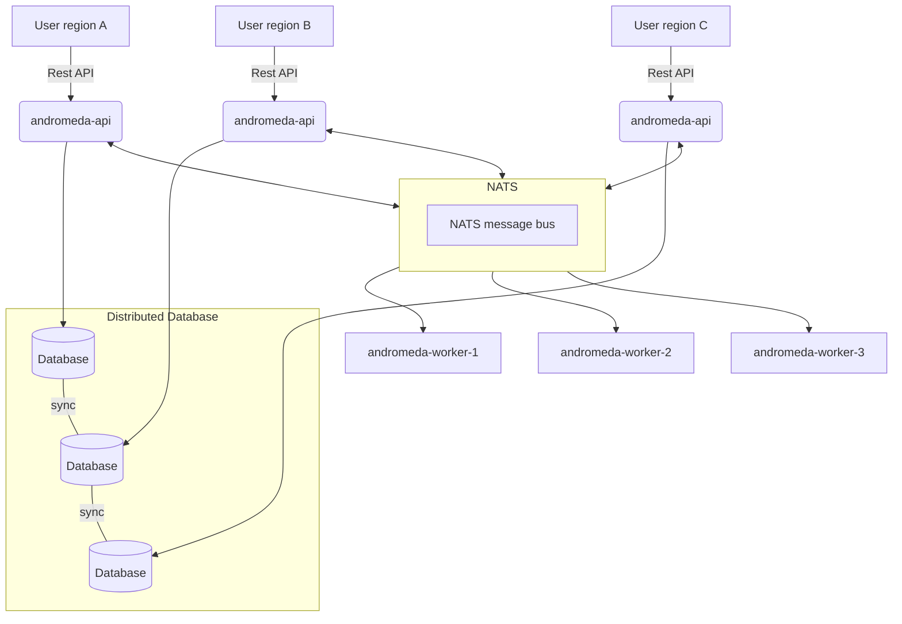

<!--
SPDX-FileCopyrightText: Copyright 2025 SAP SE or an SAP affiliate company

SPDX-License-Identifier: Apache-2.0
-->

# andromeda
Platform agnostic GSLB frontend with OpenStack-like API

Andromeda is a OpenStack like REST API Fronted for Global Loadbalancing as a Service (GLbaaS). It can support multiple backends, called provider.
Features:
* Multi-tenant capable
* keystone authentication
* OpenStack policy files
* Prometheus metrics
* Rate limiting
* OpenStack like Quota API
* Multiple Database backends supported
  * PostgreSQL
  * MariaDB (Warning, MySQL/Percona is **not** supported)
  * CockroachDB

Currently it supports following provider:
* F5 BigIP DNS
* Akamai

API Documentation: https://sapcc.github.io/andromeda/

## CLI Client
Andromeda provides a reference CLI client called `m31ctl` that uses the REST API of Andromeda.

## Running Requirements
* go 1.19
* NATS
* SQL Database (PostgreSQL/MariaDB/CockroachDB)

### Optional development requirements (needed to re-create meta sources)
* swagger https://github.com/go-swagger/go-swagger/blob/master/docs/install.md
* protoc https://grpc.io/docs/protoc-installation/
* protoc-gen-go https://github.com/golang/protobuf
* protoc-gen-micro v3 https://github.com/asim/go-micro/tree/v3/cmd/protoc-gen-micro

## Build
* Build `andromeda` and `m31ctl`: `$ make`
* Rebuild swagger metafiles: `$ make swagger`

## Example Architecture

## License
* APACHE LICENSE, VERSION 2.0
* Text version: https://www.apache.org/licenses/LICENSE-2.0.txt
* SPDX short identifier: Apache-2.0
* OSI Approved License: https://opensource.org/licenses/Apache-2.0
