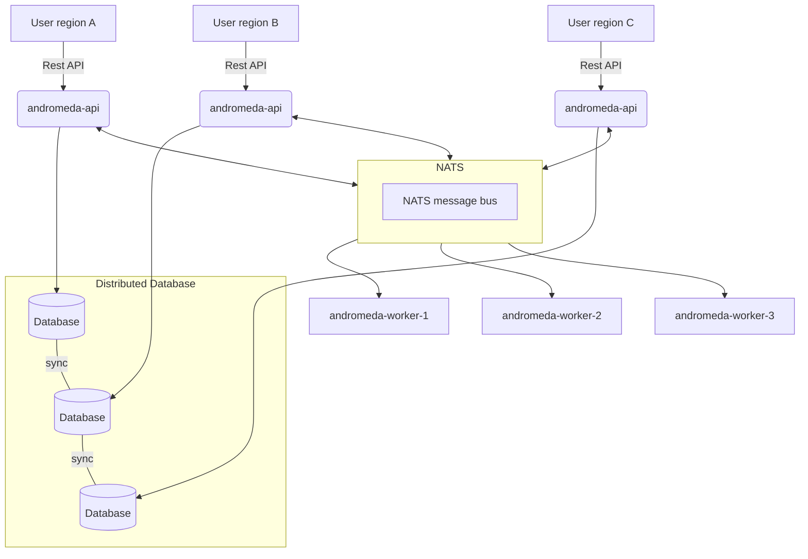

<!--
SPDX-FileCopyrightText: Copyright 2022-2025 SAP SE or an SAP affiliate company and andromeda contributors

SPDX-License-Identifier: Apache-2.0
-->

# andromeda GSLBaaS
Platform agnostic GSLB frontend with OpenStack-like API

Andromeda is a OpenStack like REST API Fronted for Global Loadbalancing as a Service (GLbaaS). It can support multiple backends, called provider.
Features:
* Multi-tenant capable
* OpenStack keystone authentication
* OpenStack policy support
* Prometheus metrics
* Rate limiting
* OpenStack like Quota API
* Multiple Database backends supported
  * PostgreSQL
  * MariaDB (Warning, MySQL/Percona is **not** supported)
  * CockroachDB

Currently it supports following GSLB provider:

* F5 BigIP DNS
* Akamai

API Documentation: https://sapcc.github.io/andromeda/

## CLI Client
Andromeda provides a reference CLI client called `m31ctl` that uses the REST API of Andromeda.

## Running Requirements
* go 1.25
* NATS
* SQL Database (PostgreSQL/MariaDB/CockroachDB)

### Build requirements
* GNU Make

Not required, will be installed by Makefile:

* [migrate](https://github.com/golang-migrate/migrate)
* [swagger](https://github.com/go-swagger/go-swagger/blob/master/docs/install.md)
* [protoc](https://grpc.io/docs/protoc-installation/)
* [protoc-gen-go](https://github.com/golang/protobuf)
* [protoc-gen-stormrpc](https://github.com/actatum/stormrpc/tree/main/cmd/protoc-gen-stormrpc)

## Build target
* Build: `$ make`
* Rebuild swagger metafiles: `$ make swagger`
* Cleanup: `$ clean`

## Example Architecture

## Support, Feedback, Contributing

This project is open to feature requests/suggestions, bug reports etc. via [GitHub issues](https://docs.github.com/en/issues/tracking-your-work-with-issues/using-issues/creating-an-issue). Contribution and feedback are encouraged and always welcome. For more information about how to contribute, the project structure, as well as additional contribution information, see our [Contribution Guidelines](https://github.com/SAP-cloud-infrastructure/.github/blob/main/CONTRIBUTING.md).

## Security / Disclosure

If you find any bug that may be a security problem, please follow our instructions [in our security policy](https://github.com/SAP-cloud-infrastructure/.github/blob/main/SECURITY.md) on how to report it. Please do not create GitHub issues for security-related doubts or problems.

## Code of Conduct

We as members, contributors, and leaders pledge to make participation in our community a harassment-free experience for everyone. By participating in this project, you agree to abide by its [Code of Conduct](https://github.com/SAP-cloud-infrastructure/.github/blob/main/CODE_OF_CONDUCT.md) at all times.

## Licensing

Copyright 2022-2025 SAP SE or an SAP affiliate company and andromeda contributors. Please see our [LICENSE](./LICENSES/Apache-2.0.txt) for copyright and license information. Detailed information including third-party components and their licensing/copyright information is available [via the REUSE tool](https://api.reuse.software/info/github.com/sapcc/andromeda).
